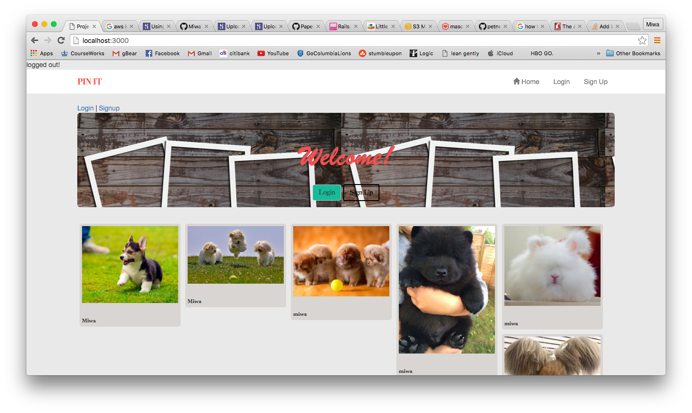
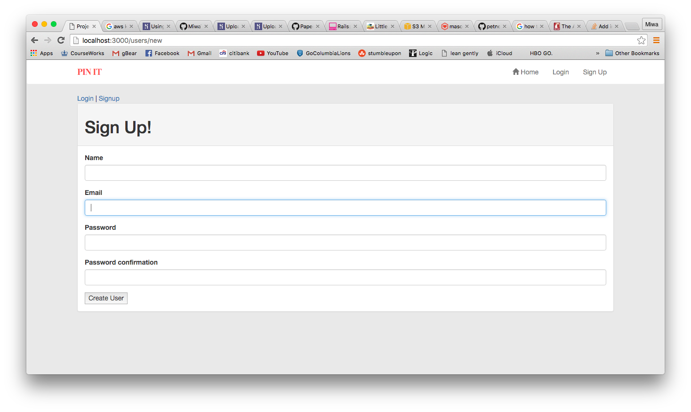
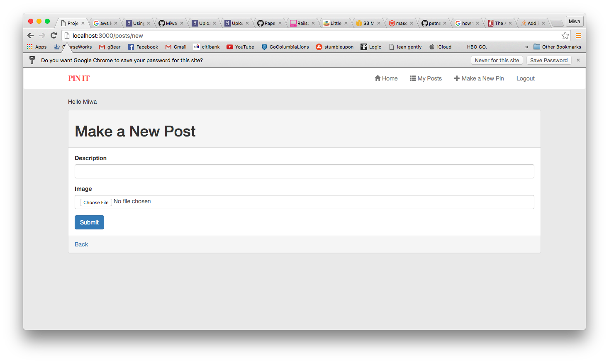
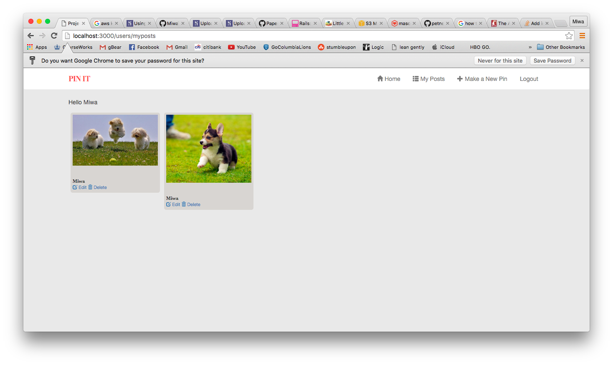
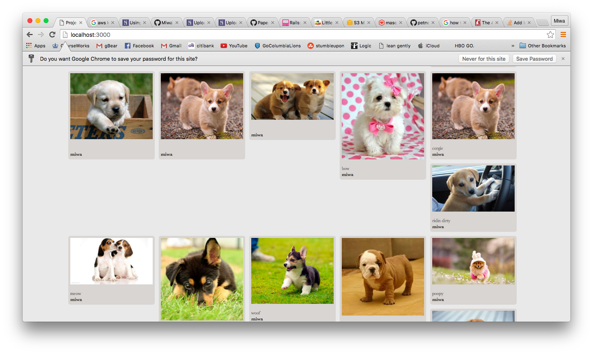

# Pin It

A photosharing site that is open to everyone.
Anyone can view the listing of all posts
However, you must register in order to submit your own posts, to like other's posts, and to comment on other posts

Members can edit only their own posts

Members can see a listing of their own posts and of other member's posts

Members can see a listing of all the posts they've liked. 

#### Technologies Used

* Ruby 2.1.5

* Rails 4.2.1

* PostgreSQL Database

* Bootstrap-SASS ~> 3.3.4

* masonry

* imagemagick

* AWS

#### Getting Started

If you fork this repo, you must run `bundle install` and `rake db:migrate` in order for the app to function properly.

#### Joining Pin It

Welcome to Pin It!
 

######Step 1: Create a Pin It

Enter your information in the form:
 

 

######Step 2: Create a Pin

Then fill in the information here and upload a photo
 

######Now you have a post!
 

######You can see all of the other pets on pin it...
 

